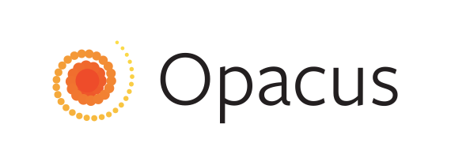

<p align="center"></p>

<hr/>

[](https://circleci.com/gh/pytorch/opacus)

[Opacus](https://opacus.ai) is a library that enables training PyTorch models with differential privacy. It supports training with minimal code changes required on the client, has little impact on training performance and allows the client to online track the privacy budget expended at any given moment.

## Target audience
This code release is aimed at two target audiences:
1. ML practitioners will find this to be a gentle introduction to training a model with differential privacy as it requires minimal code changes.
2. Differential Privacy scientists will find this easy to experiment and tinker with, allowing them to focus on what matters.


## Installation
The latest release of Opacus can be installed via `pip`:
```bash
pip install opacus
```

You can also install directly from the source for the latest features (along with its quirks and potentially ocassional bugs):
```bash
git clone https://github.com/pytorch/opacus.git
cd opacus
pip install -e .
```

## Getting started
To train your model with differential privacy, all you need to do is to declare a `PrivacyEngine` and attach it to your optimizer before running, eg:

```python
model = Net()
optimizer = SGD(model.parameters(), lr=0.05)
privacy_engine = PrivacyEngine(
    model,
    batch_size,
    sample_size,
    alphas=[1, 10, 100],
    noise_multiplier=1.3,
    max_grad_norm=1.0,
)
privacy_engine.attach(optimizer)
# Now it's business as usual
```

The [MNIST example](examples/mnist.py) shows an end-to-end run using opacus. The [examples](examples/) folder contains more such examples.

## FAQ
Checkout the [FAQ](docs/faq.md) page for answers to some of the most frequently asked questions about Differential Privacy and Opacus.

## Contributing
See the [CONTRIBUTING](CONTRIBUTING.md) file for how to help out.

## References
* [Mironov, Ilya. "Rényi differential privacy." 2017 IEEE 30th Computer Security Foundations Symposium (CSF). IEEE, 2017.](https://arxiv.org/abs/1702.07476)
* [Abadi, Martin, et al. "Deep learning with differential privacy." Proceedings of the 2016 ACM SIGSAC Conference on Computer and Communications Security. ACM, 2016.](https://arxiv.org/abs/1607.00133)
* [Mironov, Ilya, Kunal Talwar, and Li Zhang. "R\'enyi Differential Privacy of the Sampled Gaussian Mechanism." arXiv preprint arXiv:1908.10530 (2019).](https://arxiv.org/abs/1908.10530)
* [Goodfellow, Ian. "Efficient per-example gradient computations." arXiv preprint arXiv:1510.01799 (2015).](https://arxiv.org/abs/1510.01799)
* [McMahan, H. Brendan, and Galen Andrew. "A general approach to adding differential privacy to iterative training procedures." arXiv preprint arXiv:1812.06210 (2018).](https://arxiv.org/abs/1812.06210)

## License
This code is released under Apache 2.0, as found in the [LICENSE](LICENSE) file.
